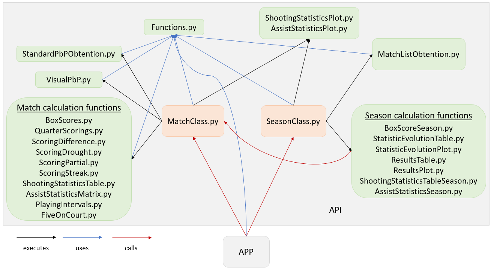

# Instructions to use the API





Follow the next steps to execute the application:

1. Create an environment:

   ```shell
   $ virtualenv venv
   ```

   

2. Activate the envrionment:

   ```shell
   $ source ./venv/bin/activate
   ```

   or

   ```shell
   $ source ./venv/Scripts/activate
   ```

   depending on what the directories names are.

   

3. Install 'requirements.txt':

   ```shell
   $ pip install -r requirements.txt
   ```

   

4. Install Tkinter to be able to use the application (App.py). It must be installed apart as it does not exist on PyPi:

   ```shell
   $ sudo apt-get install python3-tk
   ```
   
   
   
5. Enter the directory *Code*:

   ```shell
   $ cd Code
   ```

   

6. Execute the desired files from console. You can either execute the app or create a class instance.

   - If you want to try *MatchClass.py* methods, you can use *__TestMatchClass.py*, where there are examples of executions relating to match information calculation. You can uncomment the lines you are interested in.
   - If you want to try *SeasonClass.py* methods, you can use *__TestSeasonClass.py*, where there are examples of executions relating to season information calculation. You can uncomment the lines you are interested in.
   - You can execute *App.py* to execute the UI designed to execute the API methods.